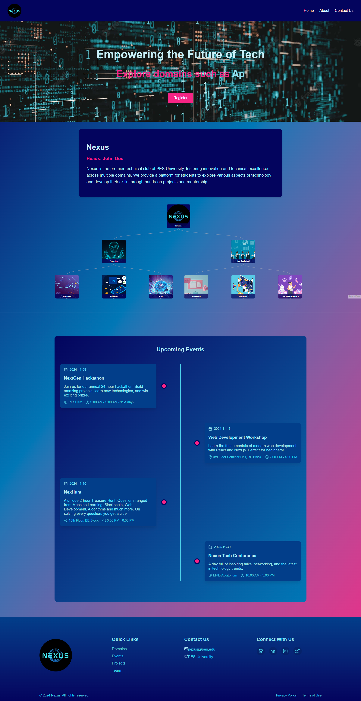

# Nexus Website

## Description

A basic website built in React for Nexus Club at PES University.

## Features

- Dynamic homepage
- Interactive club information and domain overview
- A Timeline of upcoming events

## Preview



## Technologies Used

- Frontend Framework: React
- Tree structure for Domains: React-Flow
- Build Tool: Vite

## Setup and Installation

1. Clone the repository

```bash
git clone https://github.com/omkarh20/Nexus-Website.git
```

2. Install dependencies

```bash
npm install
```

3. Run development server

```bash
npm run dev
```
